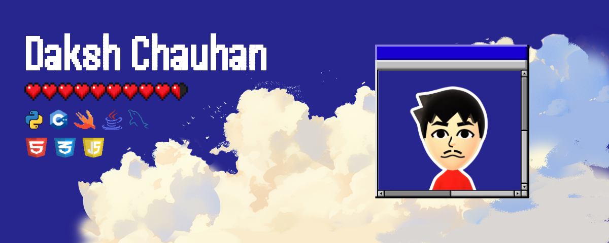

             

### Hey There!
I'm Daksh. I study Information Technology at Curtin University Dubai. I am a passionate student who loves open-source projects and I create projects that I find interesting. I've had a passion for computers and tech in general since I was a kid and I take special interest in things that are cool or help me make my life a little better.

On the side, I also love creating things! I do graphic designing, photography and am always looking for other forms of visual arts. You can view some of my work on my (very wip) [website](https://daksh.straw.page/)

  
  

